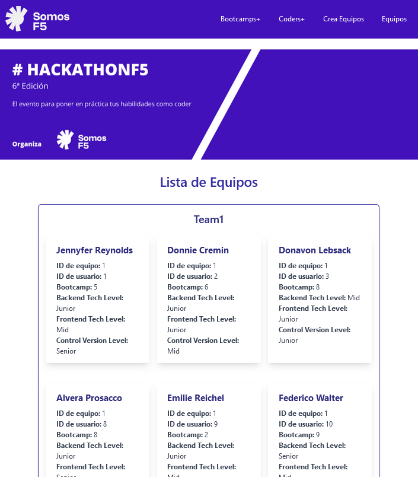

# MATCHATHON

 Matchathon, una aplicación semiautomatizada, diseñada para simplificar el proceso de formación de equipos en eventos como la Hackathon F5. Matchathon transforma la manera en que creamos equipos equitativos para alcanzar el éxito en estos desafiantes eventos, garantizando la diversidad de conocimientos y simulando un entorno de trabajo real.



## Descripción

Este repositorio alberga la "Vista" de un modelo MVC, diseñada como una interfaz de usuario dinámica utilizando React. La aplicación se integra con un backend desarrollado en Laravel, que proporciona los modelos y controladores necesarios a través de una  [API dedicada](https://github.com/Macata47/MACHATHONBACK).

La vista de este proyecto se ha creado siguiendo un enfoque atómico en React, aprovechando tecnologías modernas como React-Router-Dom, Tailwind CSS, Axios y Toastify para ofrecer una experiencia de usuario fluida y atractiva.

    Interfaz Atómica: La vista está diseñada siguiendo el principio de diseño atómico, lo que permite una fácil reutilización y mantenimiento de los componentes.

    - Integración con Backend Laravel: Se conecta de manera eficiente con el backend desarrollado en Laravel a través de peticiones HTTP utilizando Axios, permitiendo una comunicación fluida entre la vista y el servidor.

    - Gestión de Rutas: Hace uso de React-Router-Dom para gestionar las rutas dentro de la aplicación, lo que facilita la navegación entre las diferentes secciones y componentes.

    - Estilización con Tailwind CSS: La interfaz se ha estilizado de manera profesional y eficiente utilizando Tailwind CSS, lo que garantiza un diseño moderno y adaptable a diferentes dispositivos y tamaños de pantalla.

    - Notificaciones Emergentes: Se utiliza Toastify para mostrar notificaciones emergentes de manera elegante y no intrusiva, mejorando la experiencia del usuario al interactuar con la aplicación.

## Instalación

Para instalar este repositorio debes seguir los siguientes pasos: 

```bash
git clone https://github.com/LiwKltn/P-12-Matchathon-Front-end.git

npm install

npm run dev
```

## Uso

Ingresa los bootcamps
Ingresa los datos de los coders en la vista Coders+
Ingresa el mínimo y máximo de participantes
Clickar botón de crear equipos
Ver equipos creados


## Creadoras: 
[Maria Mendez](https://github.com/mariamf1985)
<br>
[Loli Vila](https://github.com/Vila71)
<br>
[Oliwia Koltun](https://github.com/LiwKltn)
<br>
[Marta Parra](https://github.com/Macata47)
<br>
[Johana Sandoval](https://github.com/Sandovaljohana)


